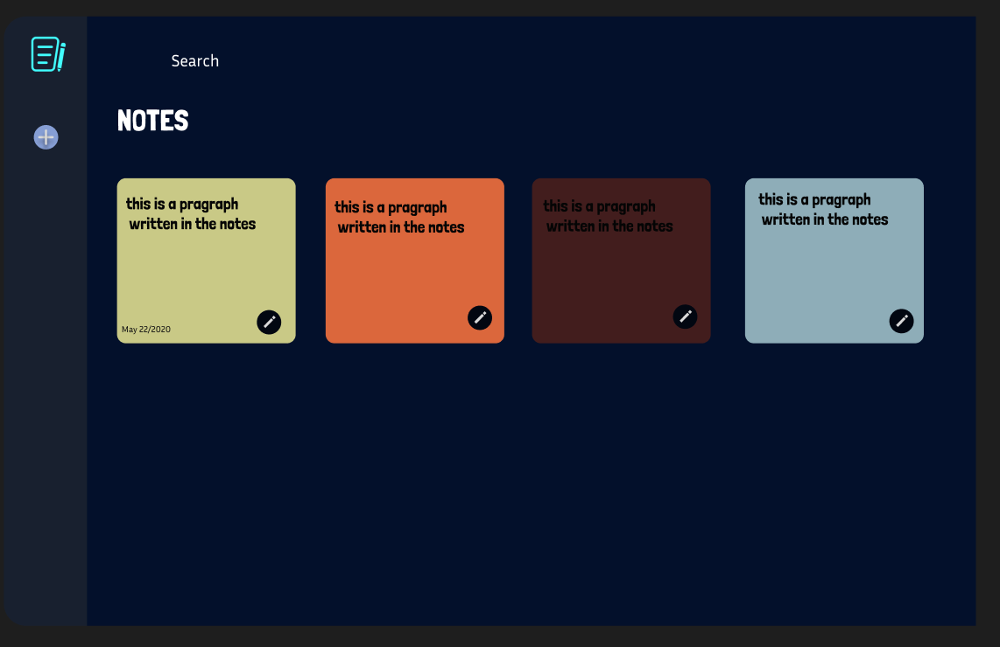

## 1. I used Claude AI to generate this code
### 2. Build me a note-taking app that looks like the picture I provided, designed in Figma
### 3. When I press the edit icon in the note tile, it should open on a different page. That page should have A title which should be editable
### 4. The "+" icon below the logo should be a button to create new notes. Any recently created notes or recently edited notes should be displayed first.
### 5. Make the notes square, and each row should have 4 notes. on the right side of the app, where there isthe logo and an add new note button present, make it into a section, and at the bottom of that sectio,n display all the tags that are given in the notes
### 6. next to the tag there should be a search icon to search desired tag. Change the logo to the .png file that I provided.
### 7. Add a delete icon for every tile from which I can delete the note. Also, lower the Tags section a little and add a scroll bar for the tags section to scroll through tags.
### 8. The delete function doesn't seam to work fix it . No need to ask for confirmation for deletion.
### 9. give some space between the logo and the add note button. Also give the add note button a hover effect.
### 10. If a note is initialized and nothing is changed don't create that note. This function should apply only to new notes, not for editing old notes.

## Reference Image
  
