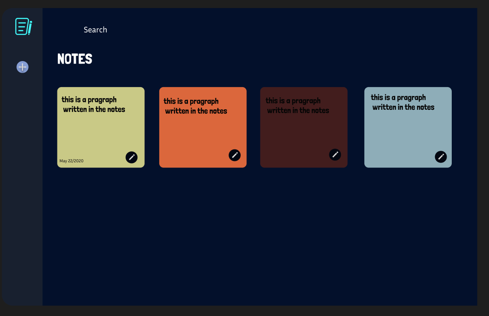

# Notes App

## URL TO THE WEB APP
    https://notesapp-smaranvangalas-projects.vercel.app/
A modern, responsive notes application built with React and Firebase, featuring real-time data persistence, tag-based organization, and search functionality.

## Features

- Create, edit, and delete notes
- Tag-based organization with hashtag support
- Real-time search functionality
- Responsive design with dark theme
- Cloud data persistence with Firebase Firestore
- Clean, intuitive user interface

## Tech Stack

### Frontend
- **React** `18.3.1` - UI framework
- **TypeScript** `5.6.3` - Type safety
- **Vite** `5.4.14` - Build tool and dev server
- **Wouter** `3.3.5` - Lightweight routing

### Styling & UI
- **Tailwind CSS** `3.4.17` - Utility-first CSS framework
- **Radix UI** `1.1.x - 2.2.x` - Accessible UI components
- **Lucide React** `0.453.0` - Icon library
- **Framer Motion** `11.13.1` - Animations

### State Management
- **TanStack React Query** `5.60.5` - Server state management
- **React Hook Form** `7.55.0` - Form handling
- **Zod** `3.24.2` - Schema validation

### Backend & Database
- **Firebase** `11.8.1` - Backend-as-a-Service
- **Firestore** - NoSQL cloud database

### Development
- **Node.js** `20.x` - Runtime environment
- **PostCSS** `8.4.47` - CSS processing
- **ESBuild** `0.25.0` - Fast bundler

## Getting Started

### Prerequisites
- Node.js 20.x or higher
- Firebase project with Firestore enabled

### Installation

1. Clone the repository
```bash
git clone https://github.com/smaranvangala/notesapp/
cd notesapp
```

2. Install dependencies
```bash
npm install
```

3. Set up environment variables
Create a `.env` file with your Firebase configuration:
```env
VITE_FIREBASE_API_KEY=your_api_key
VITE_FIREBASE_AUTH_DOMAIN=your_project.firebaseapp.com
VITE_FIREBASE_PROJECT_ID=your_project_id
VITE_FIREBASE_STORAGE_BUCKET=your_project.appspot.com
VITE_FIREBASE_MESSAGING_SENDER_ID=your_sender_id
VITE_FIREBASE_APP_ID=your_app_id
```

4. Start the development server
```bash
npm run dev
```

## Deployment

### Vercel Deployment

This project is configured for deployment on Vercel:

1. Push your code to GitHub
2. Connect your repository to Vercel
3. Add your Firebase environment variables in Vercel dashboard
4. Deploy automatically

### Firebase Setup

1. Create a Firebase project at [Firebase Console](https://console.firebase.google.com/)
2. Enable Firestore Database
3. Configure security rules for your use case
4. Get your web app configuration from Project Settings

## Project Structure

```
├── client/
│   ├── src/
│   │   ├── components/          # Reusable UI components
│   │   ├── hooks/               # Custom React hooks
│   │   ├── lib/                 # Firebase configuration
│   │   ├── utils/               # Utility functions
│   │   └── constants/           # App constants
├── vercel.json                  # Vercel deployment config
├── vite.config.client.ts        # Vite build configuration
└── DEPLOYMENT.md                # Deployment instructions
```

## PROMPTS

1. Build me a note-taking app that looks like the picture I provided, designed in Figma
2. When I press the edit icon in the note tile, it should open on a different page. That page should have A title which should be editable
3. The "+" icon below the logo should be a button to create new notes.
    Any recently created notes or recently edited notes should be displayed first.
4. Make the notes square, and each row should have 4 notes.
    on the right side of the app, where there isthe  logo and an add new note button present, make it into a section, and at the bottom of that sectio,n display all the tags that are given in the notes
5. next to the tag there should be a search icon to search desired tag.
   Change the logo to the .png file that I provided.
6. Add a delete icon for every tile from which I can delete the note.
   Also, lower the Tags section a little and add a scroll bar for the tags section to scroll through tags.
7. The delete function doesn't seam to work fix it .
   No need to ask for confirmation for deletion.
8. give some space between the logo and the add note button.
    Also give the add note button a hover effect.
9. If a note is initialized and nothing is changed don't create that note. This function should apply only to new notes, not for editing old notes.

## Reference Image
  


## License

MIT License - see LICENSE file for details
